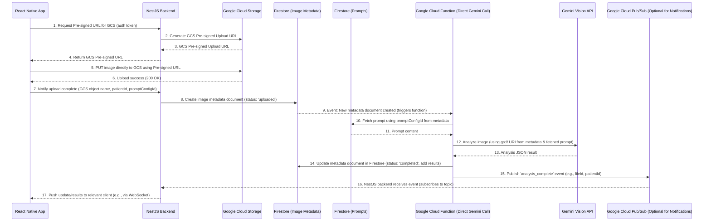

# Architectural Plan: AI Beauty Lens - Patient Profile & Analysis System

**Date:** 2025-05-14

**Objective:** Design a secure, scalable, and HIPAA-compliant architecture for managing patient profiles, associating them with clinician accounts, storing patient images, and performing AI-driven analysis using the Gemini Vision API.

## I. Core Architectural Decisions & Rationale:

1.  **Backend-Centric Approach:** A dedicated backend server is essential for managing PII/PHI, ensuring HIPAA compliance, securing API keys, and handling clinician authentication.
2.  **Image Storage:** **Google Cloud Storage (GCS)** will be used for storing patient image files due to its suitability for binary object storage, cost-effectiveness, and direct integration capabilities with Google Cloud services.
3.  **Metadata & Prompt Storage:** **Cloud Firestore** will be used to store metadata about uploaded images (GCS paths, patient/clinician associations, analysis status) and for storing prompt templates. This choice prioritizes ease of triggering Cloud Functions for analysis and efficient operational reads/writes for individual metadata records.
4.  **AI Analysis Orchestration:** A **Google Cloud Function** will be triggered by new metadata entries in Firestore. This function will directly call the **Gemini Vision API**, using the GCS URI of the image and the appropriate prompt from Firestore.
5.  **Primary Backend Technology:**
    *   **Language/Platform:** Node.js
    *   **Framework:** NestJS (using TypeScript) - chosen for its structured approach, TypeScript support (aligning with team skills), and robust ecosystem for building APIs.
6.  **Client Application:** React Native (existing).
7.  **Primary Relational Database (for Clinician/Patient Core Data - Optional but Recommended for some data):** While Firestore handles image metadata and prompts, a **Managed PostgreSQL** instance (e.g., on AWS RDS or Google Cloud SQL) is recommended for core clinician accounts and potentially structured patient demographic data if complex relational queries or strong transactional consistency for that specific data is paramount. *For the image analysis flow detailed here, Firestore is the key datastore.*
8.  **Asynchronous Notifications:** For notifying the client application of analysis completion, a combination of **Google Cloud Pub/Sub** (triggered by the analysis Cloud Function) and **WebSockets** (managed by the NestJS backend) is recommended for real-time updates. Client polling is a simpler fallback.

## II. System Components & Data Flow:

### A. Components:

1.  **Client Application (React Native):**
    *   Handles UI/UX for clinicians.
    *   Authenticates against the NestJS backend.
    *   Requests pre-signed URLs from NestJS for image uploads to GCS.
    *   Uploads images directly to GCS.
    *   Notifies NestJS of successful uploads and provides context (patientId, promptConfigId).
    *   Requests analysis from NestJS (if applicable for triggering or status checks) and receives results asynchronously.

2.  **Backend Server (NestJS on Node.js/TypeScript):**
    *   Manages clinician authentication and authorization (e.g., using Passport.js).
    *   Handles core business logic (e.g., patient management if using PostgreSQL for that).
    *   Generates GCS pre-signed URLs for client uploads.
    *   Receives upload completion notifications from the client.
    *   Writes image metadata (GCS path, patientId, clinicianId, promptConfigId, initial status like 'uploaded') to **Cloud Firestore**.
    *   (Optional but recommended for notifications) Subscribes to a Pub/Sub topic for analysis completion events and relays these to connected clients via WebSockets.
    *   Provides API endpoints for clients to poll for analysis status/results if WebSockets are not used initially.

3.  **Image Storage (Google Cloud Storage - GCS):**
    *   Securely stores patient image files.
    *   Must be configured for HIPAA compliance (BAA with Google Cloud, server-side encryption, fine-grained access controls, audit logging).
    *   Images are uploaded directly by the client using pre-signed URLs.

4.  **Metadata & Prompt Storage (Cloud Firestore):**
    *   **Image Metadata Collection:** Stores documents containing:
        *   `gcsPath` (string, e.g., `your-bucket-name/patient-uploads/image123.jpg`)
        *   `patientId` (string/reference)
        *   `clinicianId` (string/reference)
        *   `promptConfigurationId` (string/reference)
        *   `uploadTimestamp` (timestamp)
        *   `analysisStatus` (string, e.g., 'uploaded', 'processing', 'completed', 'failed')
        *   `analysisResult` (map/object, to store Gemini output or summary)
        *   Other relevant fields.
    *   **Prompt Templates Collection:** Stores documents containing:
        *   `promptConfigurationId` (string)
        *   `promptText` (string) or structured prompt components.
    *   Must be configured for HIPAA compliance (BAA with Google Cloud, Firestore Security Rules, server-side encryption).

5.  **Automated Gemini Vision Analysis (Google Cloud Function):**
    *   **Trigger:** Firestore trigger (e.g., `onCreate` for new documents in the Image Metadata Collection).
    *   **Runtime:** Node.js (to align with backend stack, or Python if preferred for ML tasks).
    *   **Logic:**
        1.  Receives the image metadata document from the Firestore event.
        2.  Fetches the appropriate prompt from the Firestore `PromptTemplates` collection using `promptConfigurationId` from the metadata.
        3.  Constructs the Gemini API request, using the GCS URI (`gs://...`) of the image and the fetched prompt.
        4.  Calls the Gemini Vision API directly using the Google Cloud AI Platform client libraries or REST API.
        5.  Receives the analysis result (JSON) from Gemini.
        6.  Updates the corresponding image metadata document in Firestore with the analysis results and sets `analysisStatus` to 'completed' (or 'failed' with error details).
        7.  (Optional) Publishes a message to a Google Cloud Pub/Sub topic upon completion/failure.
    *   **Permissions:** The Cloud Function's service account needs IAM permissions to read from GCS, read from Firestore (prompts collection), write to Firestore (metadata collection), call the Gemini API, and (optionally) publish to Pub/Sub.

6.  **Asynchronous Client Notification (Recommended):**
    *   **Google Cloud Pub/Sub:** A topic (e.g., `analysis-completion-topic`) to which the analysis Cloud Function publishes messages.
    *   **NestJS Backend:** Subscribes to this Pub/Sub topic.
    *   **WebSockets:** NestJS uses WebSocket connections to push real-time updates/results to the relevant connected client application.

### B. Data Flow Diagram:

## III. Key HIPAA Compliance Considerations:

*   **Business Associate Agreements (BAAs):** Ensure BAAs are in place with Google Cloud Platform for all services handling PHI (GCS, Firestore, Cloud Functions, Pub/Sub, Gemini API if applicable through GCP, NestJS hosting environment).
*   **Encryption:**
    *   **At Rest:** Enable server-side encryption for GCS buckets and Firestore databases.
    *   **In Transit:** Use HTTPS/TLS for all API calls (client-to-NestJS, NestJS-to-Google APIs, Cloud Function-to-Google APIs).
*   **Access Controls:**
    *   Implement strong authentication for clinicians in the NestJS backend.
    *   Use IAM roles and permissions based on the principle of least privilege for all Google Cloud services (NestJS service account, Cloud Function service account).
    *   Utilize Firestore Security Rules to protect data in Firestore.
    *   Configure GCS bucket and object ACLs/policies appropriately.
*   **Audit Logging:** Enable and regularly review audit logs for GCS, Firestore, Cloud Functions, and the NestJS application.
*   **Data Minimization:** Only collect and store PHI that is necessary.
*   **Secure Development Practices:** Follow secure coding practices for the NestJS backend and Cloud Function.
*   **De-identification/Pseudonymization:** Consider if and where de-identification techniques can be applied if full PHI is not always needed for every step.
*   **Backup and Disaster Recovery:** Implement and test backup and recovery procedures for Firestore and GCS.

## IV. Next Steps (Post-Approval):

1.  Set up Google Cloud Project and enable necessary APIs (GCS, Firestore, Cloud Functions, Vertex AI/Gemini, Pub/Sub).
2.  Develop NestJS backend:
    *   Authentication module.
    *   API endpoints for GCS pre-signed URL generation.
    *   API endpoints for finalizing uploads and writing to Firestore.
    *   (Optional) WebSocket implementation for real-time notifications.
    *   (Optional) Pub/Sub subscriber setup.
3.  Develop Cloud Function:
    *   Firestore trigger.
    *   Logic to fetch prompts.
    *   Logic to call Gemini API with GCS image URI.
    *   Logic to update Firestore with results.
    *   (Optional) Logic to publish to Pub/Sub.
4.  Configure GCS buckets, Firestore database (collections and security rules), and Pub/Sub topics.
5.  Update React Native client application to integrate with the new backend APIs for file upload and to handle asynchronous analysis results.
6.  Thoroughly test the entire flow, focusing on security and HIPAA compliance aspects.