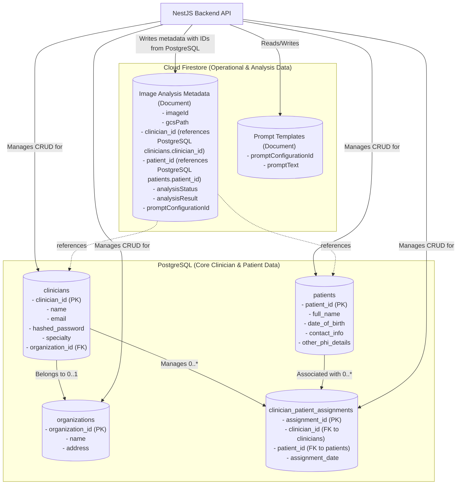

# Plan: Database Strategy for Clinician Accounts & Related Data

**Date:** 2025-05-27

**Status:** Approved

## I. Confirmed Database Strategy

1.  **Primary Choice for Clinician & Core Patient Data:** **Managed PostgreSQL** (e.g., Google Cloud SQL or AWS RDS).
    *   This will store clinician profiles, authentication details, relationships with patients, organizational affiliations, and core patient demographic data.
2.  **Complementary Choice for Operational Data:** **Cloud Firestore** (as outlined in `architectural_plan.md`).
    *   This will continue to store image analysis metadata (including `clinicianId` and `patientId` references from PostgreSQL), AI prompt templates, and facilitate the event-driven AI analysis workflow.

## II. Rationale for PostgreSQL for Clinician & Core Patient Data

*   **Relational Integrity:** PostgreSQL excels at managing structured data with well-defined relationships, which is crucial for clinician profiles, their associations with multiple patients, and organizational structures.
*   **Complex Querying:** Confirmation that complex relational queries are expected (e.g., reporting, analytics across clinicians and patients) makes PostgreSQL a strong fit due to its powerful SQL capabilities.
*   **Transactional Consistency (ACID):** For core user data and financial transactions (if applicable in the future), PostgreSQL provides strong ACID guarantees, ensuring data integrity.
*   **Mature Ecosystem:** PostgreSQL has a robust ecosystem. We will be using **Prisma** as our Object-Relational Mapper (ORM).

## III. Key Considerations for PostgreSQL with Prisma Implementation

1.  **Schema Design (Illustrative):**
    *   `clinicians`: `clinician_id` (PK), `name`, `email` (unique, indexed), `hashed_password`, `salt`, `specialty`, `organization_id` (FK), `roles`, `created_at`, `updated_at`.
    *   `patients`: `patient_id` (PK), `full_name`, `date_of_birth`, `gender`, `contact_info`, other relevant PII/PHI, `created_at`, `updated_at`.
    *   `clinician_patient_assignments`: `assignment_id` (PK), `clinician_id` (FK to `clinicians`), `patient_id` (FK to `patients`), `assignment_date`, `status` (e.g., active, inactive). This table enables a many-to-many relationship.
    *   `organizations` (if clinicians belong to clinics/hospitals): `organization_id` (PK), `name`, `address`, `contact_info`.
    *   These will be defined in the `prisma/schema.prisma` file.
2.  **Data Integrity:** Prisma schema will define relations, constraints (e.g., `@unique`, `@default`), and types. Migrations will enforce this.
3.  **Security & HIPAA Compliance:**
    *   **Encryption:** Ensure data is encrypted at rest (via managed service features) and in transit (TLS/SSL connections).
    *   **Access Control:** Implement the principle of least privilege for database user accounts used by the NestJS backend.
    *   **Audit Logging:** Configure and regularly review database audit logs.
    *   **BAA:** Ensure a Business Associate Agreement is in place with the cloud provider for the managed PostgreSQL service.
    *   **PII/PHI Handling:** Adhere to all HIPAA guidelines for storing and accessing sensitive patient data.
4.  **NestJS Integration with Prisma:**
    *   A `PrismaService` will be created to instantiate and provide the `PrismaClient`.
    *   This service will be injected into NestJS modules (e.g., `CliniciansModule`, `PatientsModule`) for database interactions.
    *   Data Transfer Objects (DTOs) will still be used for API request/response validation.
5.  **Scalability & Performance:**
    *   Choose an appropriate instance size for the managed PostgreSQL service.
    *   Implement proper indexing strategies for frequently queried columns.
    *   Plan for future scaling needs (read replicas, connection pooling).

## IV. Interaction with Firestore Data

*   The NestJS backend will be responsible for:
    1.  Authenticating clinicians against the PostgreSQL database.
    2.  Managing clinician and patient records in PostgreSQL.
    3.  When an image analysis is initiated, the NestJS backend will retrieve the `clinician_id` and relevant `patient_id` from PostgreSQL.
    4.  These IDs will then be included in the metadata document written to the **Cloud Firestore** `ImageMetadata` collection (as detailed in `architectural_plan.md`). This links the operational analysis data back to the core entities.

## V. Conceptual Data Model Diagram

## VI. Next Steps (Post-Plan Approval - Prisma Workflow)

1.  **Uninstall TypeORM Dependencies:** Remove `typeorm`, `@nestjs/typeorm`.
2.  **Remove TypeORM Entity Files:** Delete existing `.entity.ts` files.
3.  **Install Prisma Dependencies:** Install `prisma` (dev) and `@prisma/client`.
4.  **Initialize Prisma:** Run `npx prisma init` in the `backend` directory.
5.  **Configure `schema.prisma`:**
    *   Set PostgreSQL as the provider.
    *   Define data models (Clinician, Patient, Organization, ClinicianPatientAssignment) with fields and relations.
6.  **Update `.env`:** Ensure `DATABASE_URL` is correctly set for Prisma and PostgreSQL. Remove old TypeORM `DB_*` variables.
7.  **Generate Prisma Client:** Run `npx prisma generate`.
8.  **Create Initial Migration:** Run `npx prisma migrate dev --name initial_schema` to create tables in the database.
9.  **Provision Database (if not already done):** Set up a managed PostgreSQL instance.
10. **Integrate Prisma with NestJS:**
    *   Create and configure `PrismaService`.
    *   Develop NestJS modules (e.g., `CliniciansModule`, `PatientsModule`), services, and controllers using `PrismaService` for database operations.
11. **Backend Development (using Prisma):**
    *   Implement functionalities for:
        *   Clinician authentication.
        *   Clinician profile management.
        *   Patient record management.
        *   Managing assignments.
        *   Organization management.
    *   Ensure services interacting with Firestore correctly use IDs from PostgreSQL via Prisma.
12. **Security Implementation:** Apply all security and HIPAA considerations.
13. **Testing:** Thoroughly test all functionalities.