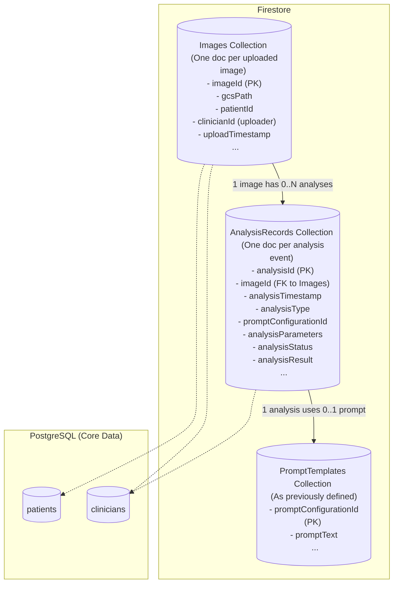
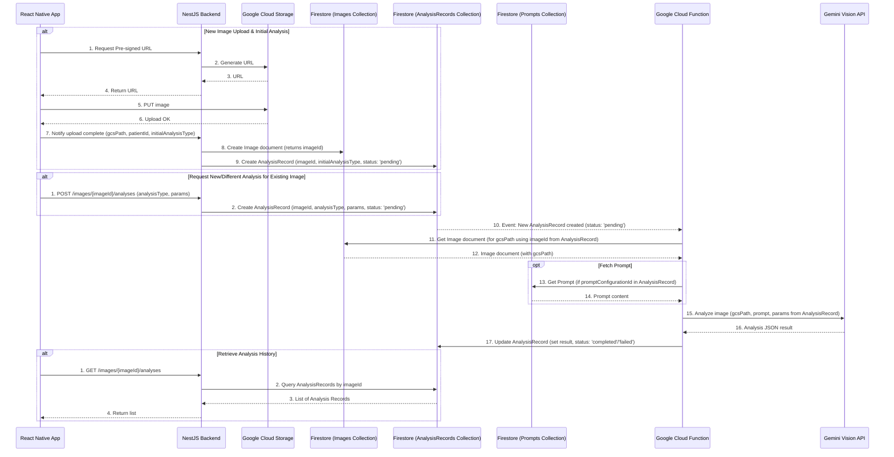

# Plan: Implementing Analysis History

**Objective:** Enhance the AIBeautyLens system to allow multiple, distinct AI analysis records (including analysis type, parameters, and results) to be stored and retrieved for each uploaded image, providing a comprehensive analysis history.

## 1. Data Model Refinement (Firestore)

The core of this change involves restructuring how we store image and analysis data in Firestore. The current model in `memory-bank/architectural_plan.md` (lines 47-55) implies a single analysis result per image document. We'll evolve this:

*   **A. `Images` Collection (Formerly `Image Metadata Collection`)**
    *   This collection will store metadata about the uploaded image itself.
    *   **Purpose:** Uniquely identify each image and its basic properties.
    *   **Proposed Fields:**
        *   `imageId` (string, PK - unique ID for the image)
        *   `gcsPath` (string - path to the image in Google Cloud Storage)
        *   `patientId` (string/reference - to PostgreSQL `patients` table)
        *   `clinicianId` (string/reference - uploader/owner, to PostgreSQL `clinicians` table)
        *   `uploadTimestamp` (timestamp)
        *   `originalFileName` (string, optional)
        *   `contentType` (string, e.g., "image/jpeg", optional)
        *   `imageNotes` (string, optional, by clinician)

*   **B. `AnalysisRecords` Collection (New)**
    *   This new collection will store individual analysis events. Each document represents one analysis performed.
    *   **Purpose:** Store each analysis attempt, its type, parameters, status, and results.
    *   **Proposed Fields:**
        *   `analysisId` (string, PK - unique ID for this specific analysis event)
        *   `imageId` (string, FK - referencing `Images.imageId`)
        *   `analysisTimestamp` (timestamp - when this analysis was initiated/completed)
        *   `analysisType` (string - e.g., "skin_hydration_v1", "pore_analysis_detailed", "wrinkle_severity_A")
        *   `promptConfigurationId` (string/reference - FK to `PromptTemplates` collection, if a specific template was used)
        *   `analysisParameters` (map - any specific settings or inputs for this particular analysis run, e.g., `{ "sensitivity": "high" }`)
        *   `analysisStatus` (string - e.g., 'pending', 'processing', 'completed', 'failed')
        *   `analysisResult` (map/object - the structured JSON output from the AI model)
        *   `errorMessage` (string - if `analysisStatus` is 'failed')
        *   `initiatedByClinicianId` (string/reference - FK to `clinicians`, if a clinician specifically triggered this analysis, distinct from the image uploader)

**Data Model Diagram (Conceptual for Firestore):**

## 2. System Component & Data Flow Adjustments

These data model changes will impact the interaction between system components:

*   **Client Application (React Native):**
    *   **New Image Upload:**
        1.  Client uploads image to GCS (as per existing flow).
        2.  Client notifies NestJS backend of successful upload (GCS path, patientId, etc.).
        3.  Client may also specify an *initial* `analysisType` and `promptConfigurationId` if the first analysis is to be specific.
    *   **Triggering New/Different Analysis on Existing Image:**
        1.  UI to allow selection of an existing image.
        2.  UI to select/input `analysisType`, `promptConfigurationId` (if applicable), and any `analysisParameters`.
        3.  Client calls a new NestJS endpoint to request this specific analysis.
    *   **Viewing Analysis History:**
        1.  UI to display a list of all `AnalysisRecords` associated with a selected `Image`.
        2.  UI to view the detailed `analysisResult` of a specific `AnalysisRecord`.

*   **Backend Server (NestJS):**
    *   **Image Upload Handling:**
        1.  Receives notification from client about new image upload.
        2.  Creates a new document in the `Images` collection.
        3.  If an initial `analysisType` is provided (or a default is configured), creates an initial document in `AnalysisRecords` collection with `imageId` referencing the new image, the specified `analysisType`, and `analysisStatus: 'pending'`. This new `AnalysisRecords` document will trigger the Cloud Function.
    *   **New API Endpoint - Request Specific Analysis:**
        *   `POST /api/images/{imageId}/analyses`
        *   Request Body: `{ analysisType: string, promptConfigurationId?: string, analysisParameters?: object, initiatedByClinicianId: string }`
        *   Action: Creates a new document in `AnalysisRecords` with the provided details, `imageId` from path, and `analysisStatus: 'pending'`.
    *   **New API Endpoint - Get Analysis History for an Image:**
        *   `GET /api/images/{imageId}/analyses`
        *   Action: Queries `AnalysisRecords` collection for all documents where `imageId` matches the path parameter. Returns a list of analysis records, perhaps sorted by `analysisTimestamp`.
    *   **New API Endpoint - Get Specific Analysis Record:**
        *   `GET /api/analyses/{analysisId}`
        *   Action: Retrieves a single document from `AnalysisRecords` by its `analysisId`.

*   **Automated Gemini Vision Analysis (Google Cloud Function):**
    *   **Trigger:** Firestore trigger on `onCreate` of new documents in the `AnalysisRecords` collection (specifically, when `analysisStatus` is 'pending' or a similar initial state).
    *   **Logic:**
        1.  Function receives the newly created `AnalysisRecords` document data.
        2.  Extracts `imageId`, `analysisType`, `promptConfigurationId`, `analysisParameters`.
        3.  Fetches the corresponding `Images` document using `imageId` to get the `gcsPath`.
        4.  If `promptConfigurationId` is present, fetches the prompt from `PromptTemplates` collection.
        5.  Constructs the Gemini API request using the `gcsPath`, the fetched prompt (if any, or a default/dynamic prompt based on `analysisType`), and `analysisParameters`.
        6.  Calls the Gemini Vision API.
        7.  Updates the *triggering* `AnalysisRecords` document in Firestore with the `analysisResult` (from Gemini) and sets `analysisStatus` to 'completed' (or 'failed' with `errorMessage`).

**Updated Data Flow Diagram (Sequence):**

## 3. Documentation Updates (`memory-bank/`)

To ensure this plan is well-integrated:

*   **`memory-bank/architectural_plan.md`:**
    *   **Section II.A.4 (Metadata & Prompt Storage):** Update to describe the two distinct collections: `Images` and `AnalysisRecords`, detailing their fields as above.
    *   **Section II.B (Data Flow Diagram):** Replace the existing Mermaid diagram with the updated one provided above.
    *   Adjust descriptions in "Backend Server" and "Automated Gemini Vision Analysis" sections to reflect interactions with the new `AnalysisRecords` collection and the modified `Images` collection.
*   **`memory-bank/productContext.md`:**
    *   Under "3. How AIBeautyLens Should Work" -> "Key features and functionalities," add:
        *   "Store and display a history of multiple, distinct AI analyses performed on each image, including the type of analysis and results."
*   **`memory-bank/progress.md`:**
    *   Under "2. What's Left to Build (High-Level)" -> "Backend:", add:
        *   "Implement Analysis History: Refactor Firestore data model for images and analysis records."
        *   "Implement Analysis History: Develop API endpoints for triggering specific analyses and retrieving analysis history."
    *   Under "2. What's Left to Build (High-Level)" -> "Cloud Functions:", add:
        *   "Update `gemini-analysis` Cloud Function to trigger from `AnalysisRecords` collection and interact with the new data model."
    *   Under "2. What's Left to Build (High-Level)" -> "Frontend:", add:
        *   "Implement UI for triggering specific types of analyses on existing images."
        *   "Implement UI for displaying analysis history for an image."
*   **`memory-bank/database_strategy_plan.md`:**
    *   In Section V (Conceptual Data Model Diagram), update the Firestore part to show `Images` and `AnalysisRecords` collections separately, similar to the Mermaid diagram in this plan. The textual description of Firestore's role in Section II.2 and IV should remain largely accurate but can be reviewed for minor wording adjustments to emphasize the two-collection approach for operational/analysis data.