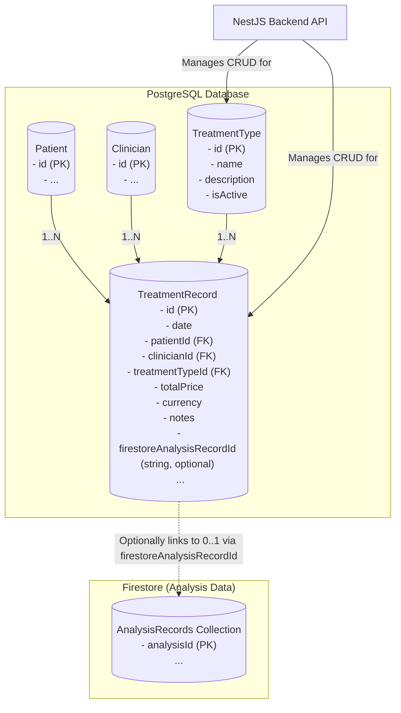

# Plan: Treatment Record Management

**Objective:** Implement a system for recording and managing patient treatment records, including treatment type (from a dynamic list), date, patient, clinician, pricing information, and an optional link to a related AI analysis record.

## 1. Database Schema Updates (PostgreSQL with Prisma)

We will add two new tables to the PostgreSQL database, managed via Prisma:

*   **A. `TreatmentTypes` Table:**
    *   **Purpose:** To store the predefined list of available treatment types.
    *   **Proposed Prisma Model (`TreatmentType`):**
        ```prisma
        model TreatmentType {
          id          String @id @default(uuid())
          name        String @unique // e.g., "Microdermabrasion", "Chemical Peel Level 1"
          description String?
          isActive    Boolean @default(true) // To allow soft-deleting or disabling types
          createdAt   DateTime @default(now())
          updatedAt   DateTime @updatedAt

          treatmentRecords TreatmentRecord[] // Relation to TreatmentRecord model
        }
        ```

*   **B. `TreatmentRecords` Table:**
    *   **Purpose:** To store individual treatment events administered to patients.
    *   **Proposed Prisma Model (`TreatmentRecord`):**
        ```prisma
        model TreatmentRecord {
          id              String @id @default(uuid())
          date            DateTime // Date and time the treatment was administered
          notes           String?  // Optional clinician notes about this specific treatment instance

          totalPrice      Decimal  // Using Decimal for currency is recommended
          currency        String   // e.g., "CAD", "USD" (ISO 4217 currency code)

          patientId       String
          patient         Patient  @relation(fields: [patientId], references: [id])

          clinicianId     String   // Clinician who administered/recorded
          clinician       Clinician @relation(fields: [clinicianId], references: [id])

          treatmentTypeId String
          treatmentType   TreatmentType @relation(fields: [treatmentTypeId], references: [id])

          // Optional: Link to an AnalysisRecord if this treatment is directly related to a specific analysis
          // This assumes an AnalysisRecord model might be defined in Prisma if we want a direct DB-level relation.
          // For now, if AnalysisRecords are purely in Firestore, this might be a string ID referencing the Firestore document.
          // Let's assume for Prisma, if we were to relate, it would look like:
          // analysisRecordId String? @unique // A treatment might be linked to one specific analysis that prompted it
          // analysisRecord   AnalysisRecord? @relation(fields: [analysisRecordId], references: [id]) // Placeholder if AnalysisRecord is a Prisma model

          // If AnalysisRecord is purely in Firestore, we'd store its ID as a simple string:
          firestoreAnalysisRecordId String? // ID of the AnalysisRecord in Firestore

          createdAt       DateTime @default(now())
          updatedAt       DateTime @updatedAt
        }
        ```
    *   **Note on `totalPrice`:** Using `Decimal` type is crucial for financial data.
    *   **Note on `firestoreAnalysisRecordId`:** This field will store the ID of the related `AnalysisRecord` document from Firestore.

## 2. Backend API (NestJS)

A new NestJS module, `TreatmentsModule`, will be created.

*   **A. `TreatmentsModule` Structure:**
    *   `treatments.module.ts`
    *   `treatments.controller.ts`
    *   `treatments.service.ts`
    *   `dto/`
        *   `create-treatment-type.dto.ts`
        *   `update-treatment-type.dto.ts`
        *   `treatment-type-response.dto.ts`
        *   `create-treatment-record.dto.ts` (will include `firestoreAnalysisRecordId?: string`)
        *   `update-treatment-record.dto.ts`
        *   `treatment-record-response.dto.ts`
    *   This module will import `PrismaModule`.

*   **B. API Endpoints:**

    *   **For `TreatmentTypes`:**
        *   `POST /api/treatment-types` - Create a new treatment type.
            *   Request: `CreateTreatmentTypeDto { name: string, description?: string }`
            *   Response: `TreatmentTypeResponseDto`
        *   `GET /api/treatment-types` - List all active treatment types.
            *   Response: `TreatmentTypeResponseDto[]`
        *   `GET /api/treatment-types/{id}` - Get a specific treatment type.
        *   `PATCH /api/treatment-types/{id}` - Update a treatment type.
        *   `DELETE /api/treatment-types/{id}` - Deactivate/soft-delete a treatment type.

    *   **For `TreatmentRecords`:**
        *   `POST /api/treatment-records` - Create a new treatment record.
            *   Request: `CreateTreatmentRecordDto { date: DateTime, patientId: string, clinicianId: string, treatmentTypeId: string, totalPrice: number, currency: string, notes?: string, firestoreAnalysisRecordId?: string }`
            *   Response: `TreatmentRecordResponseDto`
        *   `GET /api/treatment-records` - List treatment records (with filters).
            *   Response: `TreatmentRecordResponseDto[]`
        *   `GET /api/treatment-records/{id}` - Get a specific treatment record.
        *   `PATCH /api/treatment-records/{id}` - Update a treatment record.
        *   `DELETE /api/treatment-records/{id}` - Delete a treatment record.

## 3. Data Flow & Logic

*   **Creating Treatment Types:** Authorized users use `/api/treatment-types` endpoints.
*   **Creating Treatment Records:**
    1.  Clinician selects patient, treatment type (fetched from `/api/treatment-types`), enters details (date, price, currency, notes, optional linked `firestoreAnalysisRecordId`).
    2.  Frontend POSTs to `/api/treatment-records`.
    3.  `TreatmentsService` validates and creates the record in PostgreSQL.
*   **Viewing Treatment Records:** Via `GET` endpoints.

## 4. Conceptual Data Model Diagram (PostgreSQL Focus)



## 5. Documentation Updates (`memory-bank/`)

*   **`memory-bank/database_strategy_plan.md`:**
    *   Add `TreatmentType` and `TreatmentRecord` models (including `firestoreAnalysisRecordId`) to Section III.1 (Schema Design) and Section V (Conceptual Data Model Diagram).
    *   Update Section IV (Interaction with Firestore Data) to mention that `TreatmentRecords` can store a reference ID to an `AnalysisRecord` in Firestore.
*   **`memory-bank/architectural_plan.md`:**
    *   Mention the new `TreatmentsModule`.
    *   Update data flow diagrams if relevant.
*   **`memory-bank/productContext.md`:**
    *   Add "Treatment Record Management..." under "Key features and functionalities."
*   **`memory-bank/progress.md`:**
    *   Add tasks for `TreatmentsModule` (backend, DTOs, services, controllers) and frontend UI.

## 6. Frontend Considerations (High-Level)

*   UI for selecting/managing treatment types (admin).
*   UI for clinicians to create/view/update treatment records, including linking to an analysis if applicable.
*   UI for patients to view their treatment history.
*   Integration with new backend APIs.